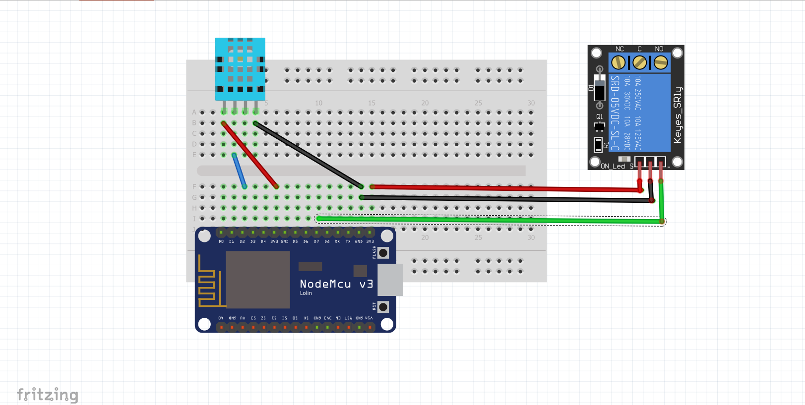
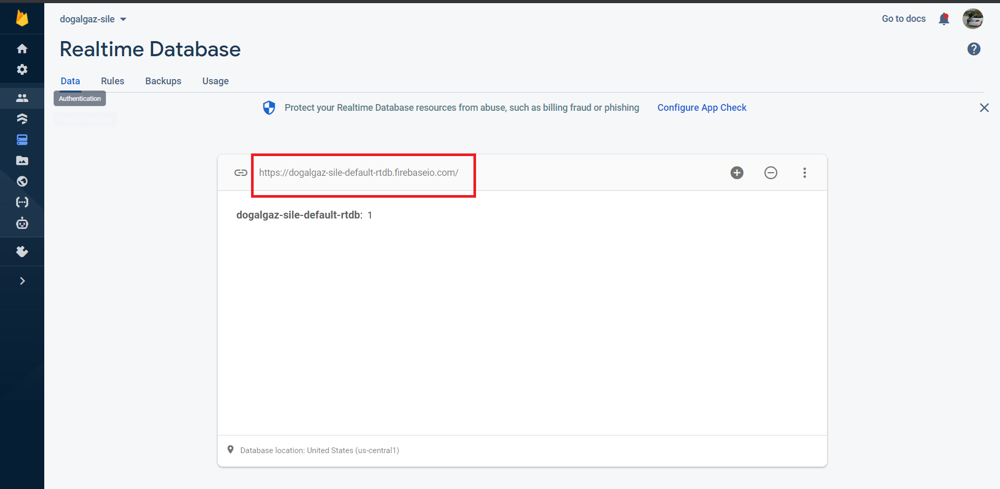
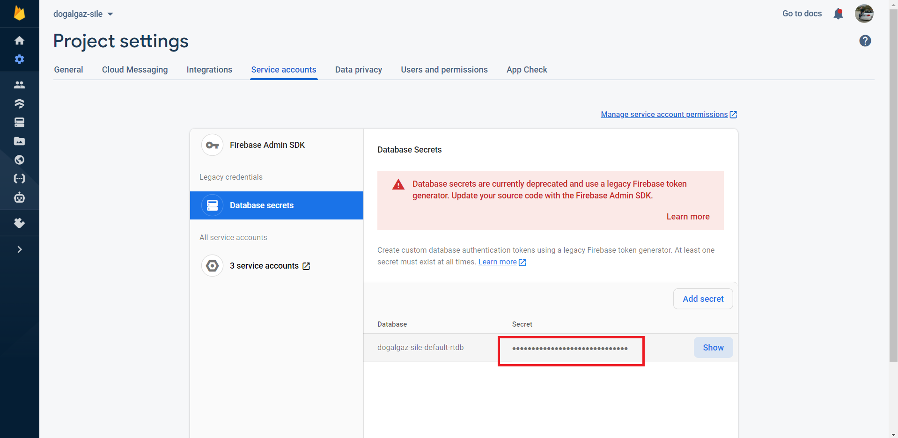
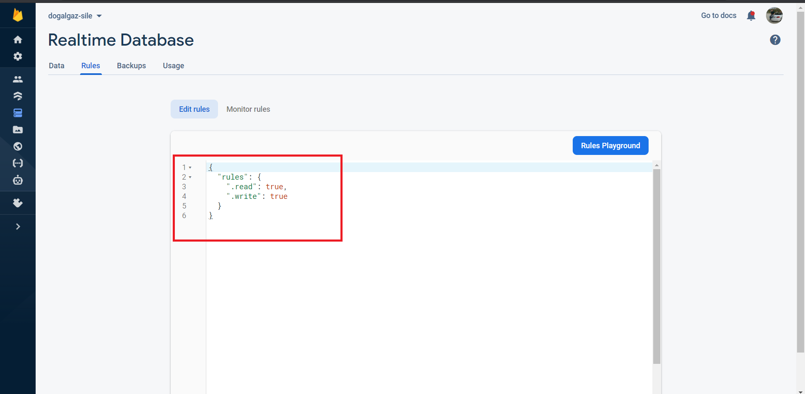

# Smart Plug with Firebase

-ENG- 

Smart plug project allows you to control your plug from anywhere in the world. With this project, you can control the plugs you forgot to turn off or you want to turn on remotely.

-TR-
 
Akıllı priz projesi, prizlerinizi dünyanın her yerinden kontrol etmenizi sağlar. Bu proje ile açık unuttuğunuz ya da açmak istediğiniz prizleri kontrol etmeniz mümkün.

## Materials Needed

1x NodeMCU LoLin ESP8266

1x Breadboard

1x DHT 11     //optional according to the project to be made 

1x 5v Relay

x Jumpers

## Circuit Diagram

-ENG-

Attention! 

If you using ESP8266 for the first time Shouldn't forget to do the esp-firebase installations!

Step1: To download Arduino Uno CH340 integrated clone card driver:
https://projekamyonu.com/arduino-klon-kart-kurulum-uno-ch-340/

Step2: To download the firebase library:
https://github.com/FirebaseExtended/firebase-arduino
Install it.

Step3: my documents -> Arduino -> libraries -> firebase-arduino-master -> src -> FirebaseHttpClient.h -> static const char FirebaseFingerprint[] = "******"     MUST be changed. You can get the fingerprint by entering the link of the database you created on Firebase here:
https://www.grc.com/fingerprints.htm

Step4: It is recommended that ArduinoJson be at least version 5.13.1. Install this version.

Step5: ESP8266 Core SDK. It is recommended to use officially tagged versions and should be at least 2.4.1. Install this version.

-TR-

Uyarı!

ESP8266'yı ilk defa kullanıyorsanız ESP ve Firebase kurulumlarını yapmayı unutmayınız!

Adım 1: Arduino Uno CH340 entegre klon kartı sürücüsünü indirmek için:
https://projekamyonu.com/arduino-klon-kart-kurulum-uno-ch-340/

Adım 2: Firebase kitaplığını indirmek için:
https://github.com/FirebaseExtended/firebase-arduino

Adım3: belgelerim -> Arduino -> kitaplıklar -> firebase-arduino-master -> kaynak -> FirebaseHttpClient.h -> static const char FirebaseFingerprint[] = "******" DEĞİŞTİRİLMELİDİR. Firebase üzerinde oluşturduğunuz veritabanının bağlantısını aşağıdaki siteye girerek parmak izinizi alabilirsiniz:
https://www.grc.com/fingerprints.htm

Adım 4: ArduinoJson'un en az 5.13.1 sürümü olması önerilir. Bu sürümü yükleyin.

Adım 5: ESP8266 sürümü en az 2.4.1 olmalıdır. Bu sürümü yükleyin.

-ENG- 

Note: This project is designed to obtain temperature information from room. 

**People who will only use this project as a smart plug do not need to use DHT sensor.**

-TR- 

Not: Bu proje, odadan sıcaklık bilgisi almak için tasarlanmıştır.

**Bu projeyi sadece akıllı priz olarak kullanacak kişilerin DHT sensörü kullanmasına gerek yoktur.**

## Details About Usage

-ENG- 

After creating a Gmail account and a database, you can make arrangements as shown in the figure.

-TR-

Gmail hesabı ve database oluşturduktan sonra şekildeki gibi düzenlemeler yapabilirsiniz.

**For Firebase / Firebase İçin:**

**1-For Firebase url / Firebase linki için:**

**2-For Firebase Token / Firebase Tokeni için:**

**3-For Database Settings / Database Ayarları İçin:**

-ENG-

-When a connection problem is encountered, a retry will be made until it is connected. The connection problem was tried to be minimized for times when not at home.

-You can check it by changing 1-0 on firebase.
Please contact me if you want access to Firebase via mobile app.

-You can check whether the values have changed or not on Firebase, and have detailed information about the situations.

-In the event of a power outage or internet outage, a reconnection will be attempted automatically, and the database will be contacted as soon as possible.

-TR- 

-Bir bağlantı sorunuyla karşılaşıldığında, bağlanana kadar yeniden deneme yapılacaktır. Evde olmadığınız zamanlarda bağlantı sorunu en aza indirilmeye çalışıldı.

-Firebase üzerinden 1-0 değer değiştirerek kontrol edebilirsiniz.
Firebase'e mobil uygulama üzerinden erişmek istiyorsanız lütfen benimle iletişime geçin.

-Değerlerin değişip değişmediğini Firebase üzerinden kontrol edebilir, durumlar hakkında detaylı bilgiye sahip olabilirsiniz.

-Elektrik kesintisi veya internet kesintisi durumunda otomatik olarak yeniden bağlantı denenecek ve en kısa sürede veri tabanı ile iletişime geçilecektir.
